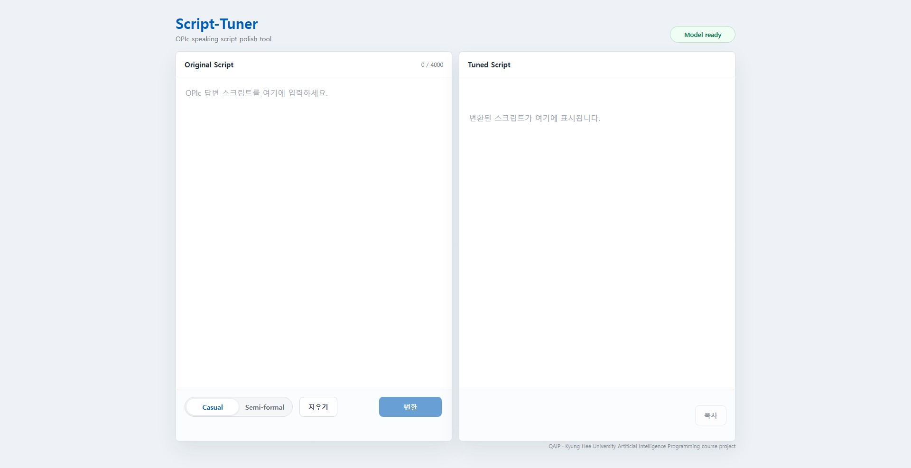

# Script-Tuner

Script-Tuner는 OPIc 답변 스크립트를 더 자연스러운 구어체 영어로 다듬는 로컬 추론 앱이다.  
왼쪽에 스크립트 초안을 입력하고 말하기 스타일을 지정하면, 모델이 더 자연스러운 스크립트로 변환해 오른쪽에 출력한다.

<서비스 화면>  


## 프로젝트 목적

비원어민 OPIc 응시자는 시험 대비를 위해 여러 주제에 적용할 수 있는 영어 스크립트를 미리 작성하는 전략을 자주 사용한다.  
이 방식은 답변 구조를 안정적으로 준비할 수 있다는 장점이 있지만, 직접 작성한 스크립트에는 영어 구어체 관점에서 부자연스러운 표현이 포함될 가능성이 높다.

문제는 이런 부자연스러움을 비원어민이 스스로 판단하기 어렵다는 점이다. 문법적으로는 맞는 문장이라도 실제 영어 회화나 OPIc 답변에서는 어색하게 들릴 수 있다.  
OPIc는 단순한 문어체 문장 작성 능력보다 자연스럽게 말하는 능력을 중요하게 보기 때문에, 지나치게 번역투이거나 문어체적인 스크립트는 실제 답변 완성도를 떨어뜨릴 수 있다.

Script-Tuner는 사용자가 작성한 스크립트 초안을 OPIc 답변에 적합한 spoken English로 바꾸는 것을 목표로 한다. 단순 문법 교정보다는 말하기 쉬운 문장 흐름, 자연스러운 표현, 원래 의미 보존에 초점을 둔다.

주요 기능은 다음과 같다.

- 문어체 또는 어색한 영어 초안을 구어체 영어로 변환한다.
- 원래 의미를 유지하면서 말하기 쉬운 문장으로 다듬는다.
- Casual / Semi-formal 스타일을 선택할 수 있다.
- 로컬 웹 UI에서 모델 로딩, 토큰 입력, 변환, 복사를 처리한다.

## 데이터 출처 및 전처리

### Casual Spoken
주요 구어체 데이터 기반은 Santa Barbara Corpus of Spoken American English(SBCSAE)이다. 
 
[SBCSAE](https://www.linguistics.ucsb.edu/research/santa-barbara-corpus-spoken-american-english)는 실제 미국 영어 대화를 CHAT 형식으로 기록한 말뭉치이며, filler, pause, backchannel, 발화 중단 같은 실제 대화 요소를 포함한다.
실제 대화를 기반으로 하므로 OPIc 답변에서 필요한 자연스러운 말하기 흐름, 반복, 짧은 pause, filler 같은 요소를 모델이 학습하는 데 적합하다.

기본 전처리 흐름은 다음과 같다.

```text
CHAT .cha 원본
-> 발화 파싱
-> 말뭉치 마커 정리
-> 동일 화자 연속 발화를 monologue로 결합
-> LLM으로 formal_text / spoken_text pair 생성
-> 학습용 JSONL과 통계 파일 생성
```

최종 학습 데이터는 `formal_text -> spoken_text` 방향의 pair 데이터이다. 즉, 다소 딱딱하거나 문어체에 가까운 영어를 자연스러운 구어체 영어로 바꾸는 문제로 구성했다.

| 항목 | 내용 |
|---|---:|
| Pair 수 | 1,757 |
| 고유 화자 수 | 131 |
| 주요 스타일 | casual |
| 학습 입력 | `formal_text` |
| 학습 목표 | `spoken_text` |
| 데이터 형식 | JSONL |


### Semi-Formal Spoken
SBCSAE 기반 데이터는 주로 casual spoken 성격을 가진다. 
최신 서비스 모델은 여기에 Semi-formal 스타일 데이터를 결합한 Combined Model로, Casual과 Semi-formal 스타일의 두 가지 모드를 선택하여 스크립트를 변환할 수 있다.
이때 Semi-formal은 대본을 읽는 낭독체가 아니라, 실제 말하기 느낌은 유지하되 filler를 줄이고 어휘와 구성을 조금 더 정돈한 발화를 뜻한다.

이에 맞는 데이터는 다음 기준으로 확보했다.

- TED처럼 scripted/rehearsed 성격이 강한 낭독체 데이터는 제외한다.
- LLM으로 `spoken_text` target을 합성하지 않는다.
- `spoken_text` target은 실제 사람의 발화 corpus에서 가져온다.

이러한 기준을 두는 이유는 프로젝트의 목표가 '대본 읽는 느낌'을 제거하는 것이기 때문이다. Semi-formal이라고 해서 정돈된 낭독체를 학습하면, 모델이 오히려 제거해야 할 대본식 표현을 다시 생성할 우려가 있다.

이에 따라 AMI, ICSI Meeting corpus 데이터를 Semi-formal 스타일 데이터의 주요 출처로 사용하였다.  

[AMI Meeting Corpus](https://groups.inf.ed.ac.uk/ami/corpus/)는 약 100시간 분량의 회의 녹음·전사·다중 모달 데이터를 포함한다. 공식 설명상 약 3분의 2는 설계팀 역할극 시나리오로, 나머지는 다양한 도메인의 자연 발생 회의로 구성되어 있다.  전사와 annotation이 공개되어 있으며, 데이터는 CC BY 4.0으로 공개되어 있다.  

[ICSI Meeting corpus](https://groups.inf.ed.ac.uk/ami/icsi/)는 약 70시간 분량의 회의 녹음 및 전사 데이터이며, 역시 CC BY 4.0으로 공개되어 있다.  

위 두 데이터를 조합한 AMI + ICSI Meeting corpus를 같은 로직으로 전처리하여 학습에 사용하였다.  

 University of Michigan에서 기록된 학술 스피치 데이터셋인 [MICASE](https://quod.lib.umich.edu/m/micase/) 또한 확보하였으나, CC BY 4.0 라이센스가 현행인지 불명확하여 학습에 사용하지 않았다.


## 모델 구현

Script-Tuner의 핵심 문제는 style transfer이다.

```text
입력: 사용자가 작성한 문어체 또는 어색한 영어 답변
출력: 의미는 유지하되 더 자연스럽게 말할 수 있는 영어 답변
```

학습 준비 과정은 다음과 같다.

1. SBCSAE 발화 데이터를 공통 IR 구조로 파싱했다.
2. pause, filler, backchannel 등 구어체 특징을 분석했다.
3. 동일 화자의 연속 발화를 monologue 단위로 묶었다.
4. LLM으로 spoken text에 대응하는 formal paraphrase를 생성했다.
5. `formal_text -> spoken_text` pair를 speaker-aware 방식으로 train / validation / test로 분리했다.
6. 모델 계열별 fine-tuning 형식으로 데이터를 변환했다.

데이터 분리에는 speaker-aware split을 사용했다. 같은 화자가 train과 test에 동시에 들어가면 모델이 일반화 능력보다 특정 화자의 말투를 기억하는 것처럼 보일 수 있기 때문이다.

학습 준비 단계에서 고려한 모델 계열은 다음과 같다.

| 모델 키 | 데이터 형식 | 용도 |
|---|---|---|
| `gemma4-e4b` | chat | 주력 후보 모델 |
| `gemma4-e2b` | chat | 경량 비교 모델 |
| `qwen3-4b` | chat | 대안 비교 모델 |
| `qwen3-1.7b` | chat | 경량 대안 모델 |
| `t5gemma2` | seq2seq | encoder-decoder 계열 비교 모델 |

현재 배포용 추론 앱은 Hugging Face에 업로드된 최신 Combined Model을 사용한다. 이 모델은 casual spoken 데이터와 Semi-formal 데이터가 결합된 모델이며, UI의 Casual / Semi-formal 선택에 따라 변환 스타일을 다르게 적용한다.

```text
aip-scripttuner-team/scripttuner-t5gemma2-1b
```

모델 repository가 gated 또는 private일 수 있으므로 Hugging Face token이 필요하다. 토큰이 없으면 웹 UI에서 입력받아 현재 실행 세션에 적용한다.

학습 target인 `spoken_text`는 실제 전사 데이터에서 오므로, 원본 말뭉치의 전사 표기가 일부 남을 수 있다. 예를 들어 CHAT 전사 방식에서는 `word .`처럼 부호 앞에 공백이 들어가거나, 쉼표와 물음표가 일반 문장보다 적게 나타날 수 있다. 이는 모델 자체의 단순 오류라기보다 학습 target의 표기 방식에서 비롯된 문제이다.

따라서 모델 구현과 서비스 후처리에서는 다음 구두점 정규화 원칙을 적용한다.

- 부호 앞 공백은 제거한다. 예: `word .` -> `word.`
- 중복 온점은 정리하되 생략부호 `...`는 보존한다.
- pause token 제거 뒤에도 같은 구두점 정규화가 적용되어야 한다.
- 문법 교정은 현재 모델의 기본 역할이 아니다.

이 앱은 사용자가 보는 최종 결과가 지나치게 전사체처럼 보이지 않도록 모델 출력 후처리를 적용해야 한다. 다만 입력 문장의 문법 오류 자체를 고치는 기능은 별도 L2 오류 데이터가 필요한 후속 과제로 본다.

## 프론트엔드 구성

프론트엔드는 별도 빌드 도구 없이 정적 HTML, CSS, JavaScript로 구성된다.

```text
web/
  index.html   # 화면 구조
  styles.css   # 레이아웃과 시각 스타일
  app.js       # 상태 확인, 변환 요청, 토큰 입력, 복사 기능
```

화면은 두 패널로 구성된다.

- `Original Script`: 사용자가 OPIc 답변 초안을 입력한다.
- `Tuned Script`: 모델이 변환한 결과를 표시한다.

주요 UI 기능은 다음과 같다.

- 입력 글자 수를 표시한다.
- Casual / Semi-formal 스타일을 선택한다.
- 모델 로딩 상태를 표시한다.
- Hugging Face token을 입력한다.
- 변환 요청과 로딩 상태를 처리한다.
- 변환 결과를 클립보드에 복사한다.
- 로컬 백엔드 상태를 주기적으로 확인한다.

결과 출력창의 대기 문구는 입력창 placeholder와 같은 시작 위치에 오도록 CSS를 맞췄다.

## 백엔드 구성

백엔드는 Python 표준 라이브러리 기반 HTTP 서버와 Hugging Face Transformers 추론 코드로 구성된다.

```text
app/
  config.py    # 모델 ID, 포트, 추론 파라미터 설정
  model.py     # 모델 로딩 및 추론
  server.py    # HTTP API와 정적 파일 제공

bootstrap.py   # venv 생성, 의존성 설치, 앱 실행
run_app.py     # 서버 실행 진입점
requirements.txt
```

주요 API는 다음과 같다.

| 경로 | 메서드 | 설명 |
|---|---|---|
| `/` | GET | 웹 UI 제공 |
| `/status` | GET | 서버와 모델 상태 반환 |
| `/token` | POST | Hugging Face token 등록 |
| `/tune` | POST | 입력 스크립트 변환 |
| `/health` | GET | 서버 상태 확인 |

## 실행 방법

Windows에서는 `Start ScriptTuner.bat`을 실행한다.

1. `ScriptTuner` 폴더를 연다.
2. `Start ScriptTuner.bat`을 실행한다.
3. 첫 실행 시 `.venv`가 생성되고 필요한 패키지가 설치된다.
4. 로컬 서버가 실행되면 브라우저가 자동으로 열린다.
5. Hugging Face token이 필요하면 `hf_`로 시작하는 토큰을 입력한다.
6. 모델 로딩이 끝나면 왼쪽에 스크립트를 입력하고 `변환` 버튼을 누른다.

기본 접속 주소는 다음과 같다.

```text
http://127.0.0.1:7860/
```

## 환경 변수

필요하면 실행 전에 환경 변수를 설정한다.

```powershell
$env:HF_TOKEN="hf_..."
$env:SCRIPT_TUNER_MODEL_ID="aip-scripttuner-team/scripttuner-t5gemma2-1b"
$env:SCRIPT_TUNER_PORT="7860"
```

주요 설정값은 다음과 같다.

| 환경 변수 | 기본값 | 설명 |
|---|---|---|
| `SCRIPT_TUNER_MODEL_ID` | `aip-scripttuner-team/scripttuner-t5gemma2-1b` | 사용할 Hugging Face 모델 |
| `SCRIPT_TUNER_HOST` | `127.0.0.1` | 서버 host |
| `SCRIPT_TUNER_PORT` | `7860` | 서버 port |
| `SCRIPT_TUNER_MAX_INPUT_CHARS` | `4000` | 최대 입력 글자 수 |
| `SCRIPT_TUNER_MAX_NEW_TOKENS` | `256` | 생성 토큰 수 |
| `SCRIPT_TUNER_WARMUP` | `1` | 모델 warmup 실행 여부 |

## Python 실행 위치 검토

`Start ScriptTuner.bat`은 Python 위치 의존성을 줄이기 위해 다음 순서로 Python 3.11 이상을 찾는다.

1. `py -3`
2. `python`
3. `python3`
4. `%SystemRoot%\py.exe`
5. Windows Python registry의 `ExecutablePath`
6. `%LocalAppData%\Programs\Python\Python3*\python.exe`
7. `%ProgramFiles%\Python3*\python.exe`
8. `%ProgramFiles(x86)%\Python3*\python.exe`

따라서 일반적인 Python 설치라면 PATH에 등록되어 있지 않아도 실행될 가능성이 높다.  
다만 임의 경로에만 설치되어 있고 시스템 등록이 전혀 없는 Python은 사용자가 PATH에 추가하거나 배치 파일에 경로를 직접 지정해야 한다.

## 개발 및 검증

Python 문법 확인은 다음 명령으로 수행한다.

```powershell
python -m py_compile bootstrap.py run_app.py app\config.py app\model.py app\server.py
```

프론트엔드 JavaScript 문법 확인은 다음 명령으로 수행한다.

```powershell
node --check web\app.js
```

## 추신

본 Script-Tuner 서비스는 경희대학교 인공지능프로그래밍 수업의 팀 프로젝트의 일환으로, QAIP 팀에 의해 개발되었다.